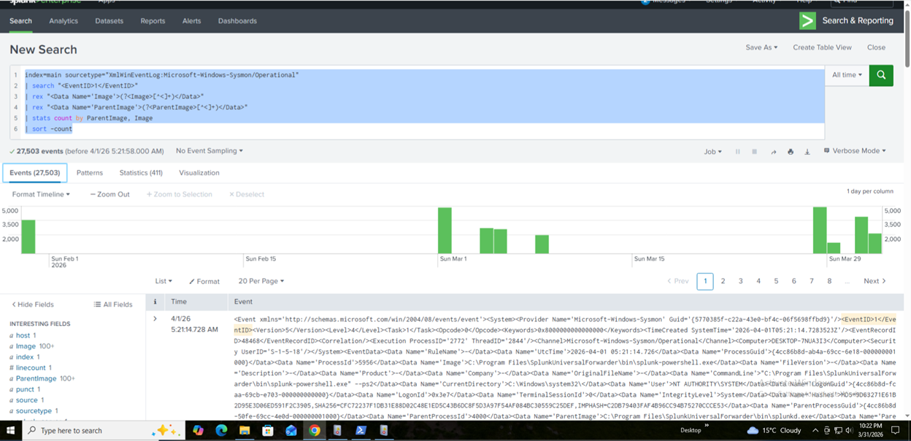
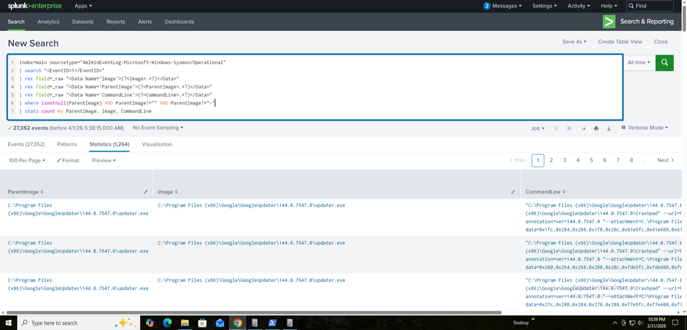
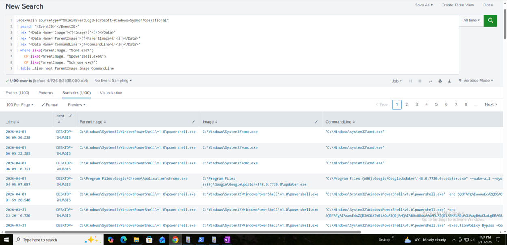
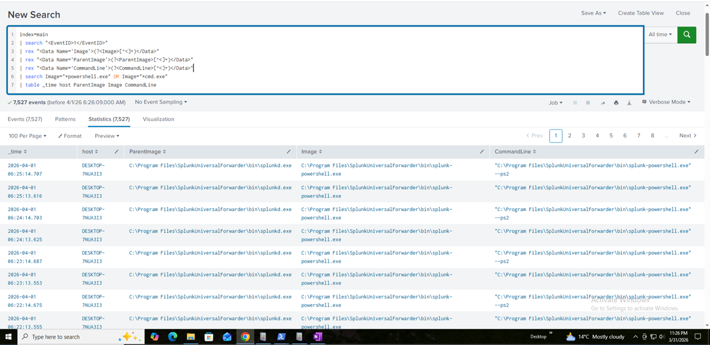
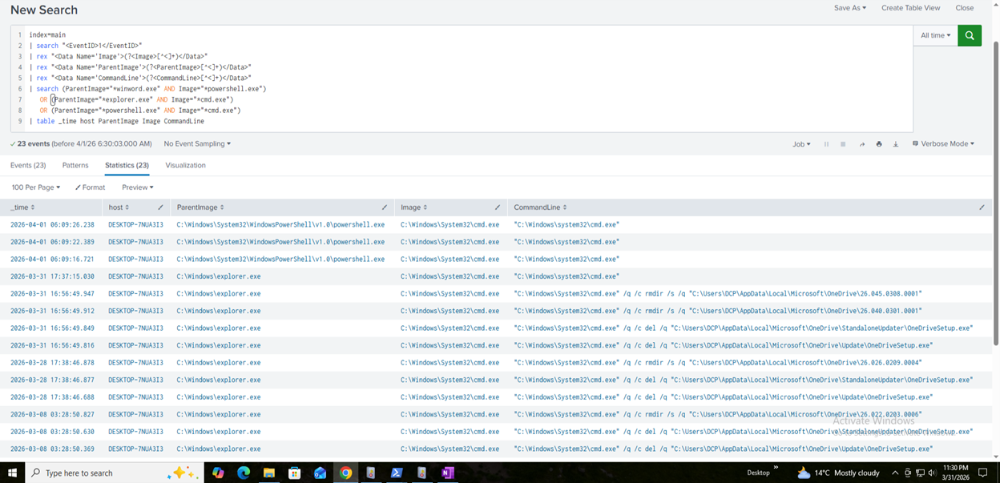
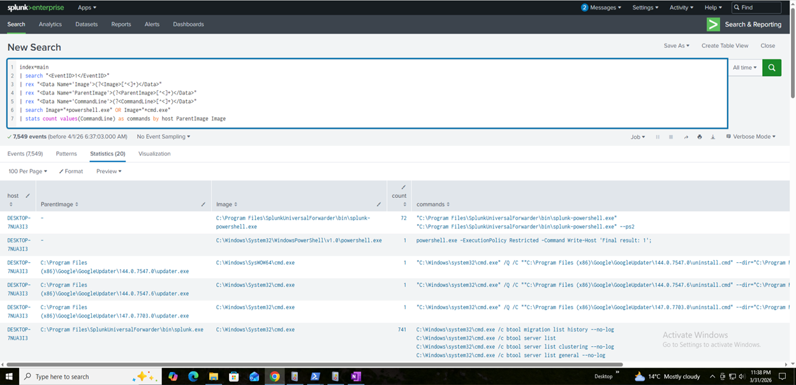

# Detection: Parent-Child Process Abuse (Sysmon Event ID 1)

## Objective
Detect suspicious parent-child process relationships that indicate potential malicious execution.

## Detection Metadata
- Severity: High
- MITRE ATT&CK:
  - T1059 (Command Execution)
  - T1204 (User Execution)
  - T1547 (Persistence)

## Data Source
- Sysmon Event ID 1 (Process Creation)

---


## OBJECTIVE

Detect suspicious process relationships where:

* A parent process spawns an unusual child process

* Often indicates:
    - Malware execution
    - Living-off-the-land attacks
    - Privilege abuse

## REAL-WORLD EXAMPLES

| Parent         | Child          | Why Suspicious |
| -------------- | -------------- | -------------- |
| winword.exe    | powershell.exe | Macro attack   |
| explorer.exe   | cmd.exe        | User execution |
| powershell.exe | cmd.exe        | LOLBins        |
| services.exe   | powershell.exe | Persistence    |


## STEP 1 — Validate Process Logs

Query

```spl
index=main sourcetype="XmlWinEventLog:Microsoft-Windows-Sysmon/Operational"
| search "<EventID>1</EventID>"
| rex "<Data Name='Image'>(?<Image>[^<]+)</Data>"
| rex "<Data Name='ParentImage'>(?<ParentImage>[^<]+)</Data>"
| stats count by ParentImage, Image
| sort -count
```




## STEP 2 — View Raw Process Execution

Shows all parent-child relationships

Confirms Sysmon logging is working

Query

```spl
index=main sourcetype="XmlWinEventLog:Microsoft-Windows-Sysmon/Operational"
| search "<EventID>1</EventID>"
| rex field=_raw "<Data Name='Image'>(?<Image>.*?)</Data>"
| rex field=_raw "<Data Name='ParentImage'>(?<ParentImage>.*?)</Data>"
| rex field=_raw "<Data Name='CommandLine'>(?<CommandLine>.*?)</Data>"
| where isnotnull(ParentImage) AND ParentImage!="" AND ParentImage!="-"
| stats count by ParentImage, Image, CommandLine

```



---


## STEP 3 — Detect Suspicious Parents

Query

```spl
index=main sourcetype="XmlWinEventLog:Microsoft-Windows-Sysmon/Operational"
| search "<EventID>1</EventID>"
| rex "<Data Name='Image'>(?<Image>[^<]+)</Data>"
| rex "<Data Name='ParentImage'>(?<ParentImage>[^<]+)</Data>"
| rex "<Data Name='CommandLine'>(?<CommandLine>[^<]+)</Data>"
| where like(ParentImage, "%cmd.exe%") 
    OR like(ParentImage, "%powershell.exe%") 
    OR like(ParentImage, "%chrome.exe%")
| table _time host ParentImage Image CommandLine
```




## STEP 4 — Detect Suspicious Children

Query

```spl
index=main 
| search "<EventID>1</EventID>"
| rex "<Data Name='Image'>(?<Image>[^<]+)</Data>"
| rex "<Data Name='ParentImage'>(?<ParentImage>[^<]+)</Data>"
| rex "<Data Name='CommandLine'>(?<CommandLine>[^<]+)</Data>"
| search Image="*powershell.exe" OR Image="*cmd.exe"
| table _time host ParentImage Image CommandLine
```




## STEP 5 — High-Risk Combinations

Query

```spl
index=main 
| search "<EventID>1</EventID>"
| search (ParentImage="*winword.exe" AND Image="*powershell.exe")
   OR (ParentImage="*explorer.exe" AND Image="*cmd.exe")
   OR (ParentImage="*powershell.exe" AND Image="*cmd.exe")
| table _time host ParentImage Image CommandLine
```




STEP 6 — Final Detection (SOC LEVEL)

Query

```spl
index=main
| search "<EventID>1</EventID>"
| rex "<Data Name='Image'>(?<Image>[^<]+)</Data>"
| rex "<Data Name='ParentImage'>(?<ParentImage>[^<]+)</Data>"
| rex "<Data Name='CommandLine'>(?<CommandLine>[^<]+)</Data>"
| search Image="*powershell.exe" OR Image="*cmd.exe"
| stats count values(CommandLine) as commands by host ParentImage Image

```



