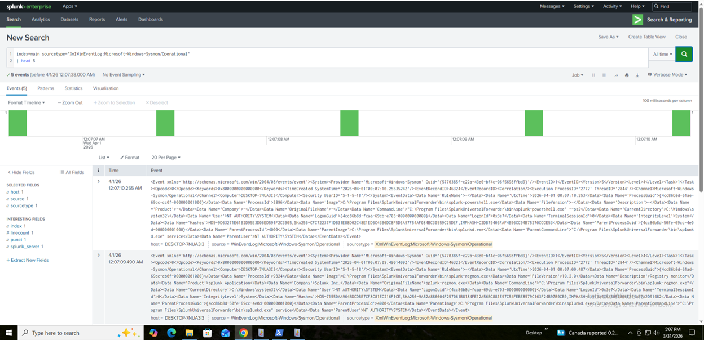
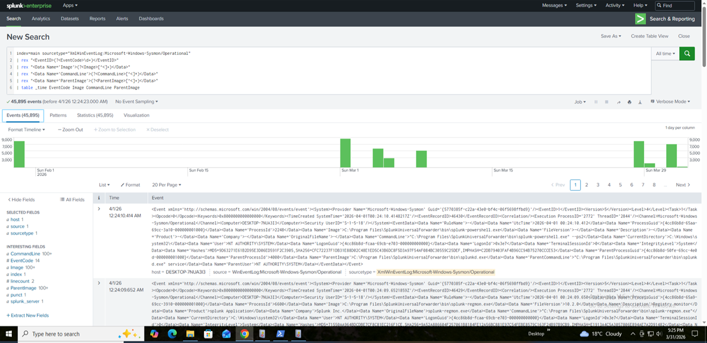
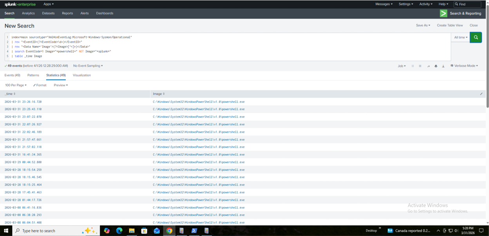
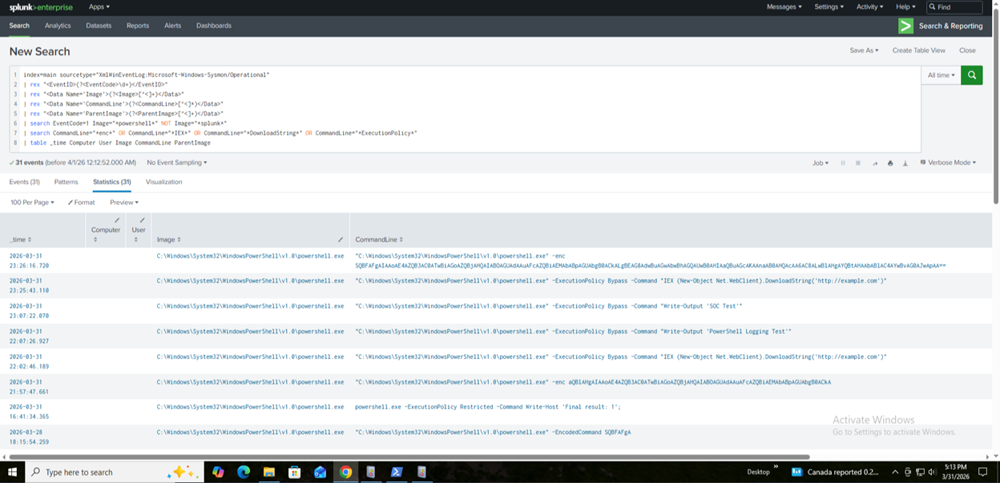

# Detection: Suspicious PowerShell Execution

## Objective

Detect potentially malicious PowerShell execution based on suspicious command-line behavior and known attacker techniques.

---

## Data Sources

- Sysmon Event ID 1 (Process Creation)
- Source Type: XmlWinEventLog:Microsoft-Windows-Sysmon/Operational

Fields extracted:
- Image
- CommandLine
- ParentImage
- User
- Computer

---

## Detection Development Process


## Step 1 — Validate Sysmon Logs

```spl
index=main sourcetype="XmlWinEventLog:Microsoft-Windows-Sysmon/Operational"
| rex "<EventID>(?<EventCode>\d+)</EventID>"
| stats count by EventCode

```


---

## Step 2 — Inspect Raw Logs

```spl
index=main sourcetype="XmlWinEventLog:Microsoft-Windows-Sysmon/Operational"
| head 5
```


---


## Step 3 — Field Extraction

```spl
index=main sourcetype="XmlWinEventLog:Microsoft-Windows-Sysmon/Operational"
| rex "<EventID>(?<EventCode>\d+)</EventID>"
| rex "<Data Name='Image'>(?<Image>[^<]+)</Data>"
| rex "<Data Name='CommandLine'>(?<CommandLine>[^<]*)</Data>"
| rex "<Data Name='ParentImage'>(?<ParentImage>[^<]+)</Data>"
| table _time EventCode Image CommandLine ParentImage
```



---


## Step 4 — Filter PowerShell Activity

This step isolates PowerShell executions from all process creation events.

```spl
index=main sourcetype="XmlWinEventLog:Microsoft-Windows-Sysmon/Operational"
| rex "<EventID>(?<EventCode>\d+)</EventID>"
| rex "<Data Name='Image'>(?<Image>[^<]+)</Data>"
| search EventCode=1 Image="*powershell*" NOT Image="*splunk*"
| table _time Image
```



---


## Step 5 — Detect Suspicious Behavior

```spl
index=main sourcetype="XmlWinEventLog:Microsoft-Windows-Sysmon/Operational"
| rex "<EventID>(?<EventCode>\d+)</EventID>"
| rex "<Data Name='Image'>(?<Image>[^<]+)</Data>"
| rex "<Data Name='CommandLine'>(?<CommandLine>[^<]*)</Data>"
| search EventCode=1 Image="*powershell*" NOT Image="*splunk*"
| search CommandLine="*enc*" OR CommandLine="*IEX*" OR CommandLine="*DownloadString*" OR CommandLine="*ExecutionPolicy*"
| table _time Computer User Image CommandLine ParentImage
```



---


## Step 6 — Final Detection Output

```spl
index=main sourcetype="XmlWinEventLog:Microsoft-Windows-Sysmon/Operational"
| rex "<EventID>(?<EventCode>\d+)</EventID>"
| rex "<Data Name='Image'>(?<Image>[^<]+)</Data>"
| rex "<Data Name='CommandLine'>(?<CommandLine>[^<]*)</Data>"
| rex "<Data Name='ParentImage'>(?<ParentImage>[^<]+)</Data>"
| rex "<Data Name='User'>(?<User>[^<]*)</Data>"
| rex "<Data Name='Computer'>(?<Computer>[^<]*)</Data>"
| search EventCode=1 Image="*powershell*" NOT Image="*splunk*"
| search CommandLine="*enc*" OR CommandLine="*IEX*" OR CommandLine="*DownloadString*" OR CommandLine="*ExecutionPolicy*"
| fillnull value="unknown" Computer User
| stats count values(CommandLine) as commands values(ParentImage) as parent_process by Computer, User

```


---


## Step 7 — Raw XML Event Analysis

```spl
index=main sourcetype="XmlWinEventLog:Microsoft-Windows-Sysmon/Operational"
| head 1
| table _raw
```


## Detection Rationale

PowerShell is frequently abused by attackers due to its ability to execute scripts directly in memory.

This detection identifies suspicious execution patterns such as:

- Encoded commands (-enc, EncodedCommand)
- Use of Invoke-Expression (IEX)
- Downloading payloads (DownloadString, Invoke-WebRequest)
- Execution policy bypass techniques

These behaviors are commonly associated with:

- Fileless malware
- Initial access techniques
- Command and control activity

---

## Detection Validation

This detection was validated using simulated attack commands:

- PowerShell encoded execution (-enc)
- ExecutionPolicy Bypass
- IEX (Invoke-Expression)
- DownloadString payload retrieval

All simulated attack behaviors were successfully detected.

---

## Noise Reduction

During analysis, Splunk internal processes were observed:

```spl
splunk-powershell.exe
splunk-netmon.exe
```

These were excluded using:

```spl
NOT Image="*splunk*"
```

This significantly reduced false positives.

## False Positive Considerations

Legitimate activities may trigger this detection:

- IT automation scripts
- Administrative PowerShell usage
- Software deployment tools

## Tuning Strategy
- Baseline normal PowerShell usage
- Exclude known administrative scripts
- Apply frequency-based filtering

Example:
```spl
| where count > 2
```
## Detection Limitations

- Obfuscated commands may evade keyword-based detection
- Some attackers avoid common flags like -enc
- Script content is not analyzed (covered in 4104 detection)